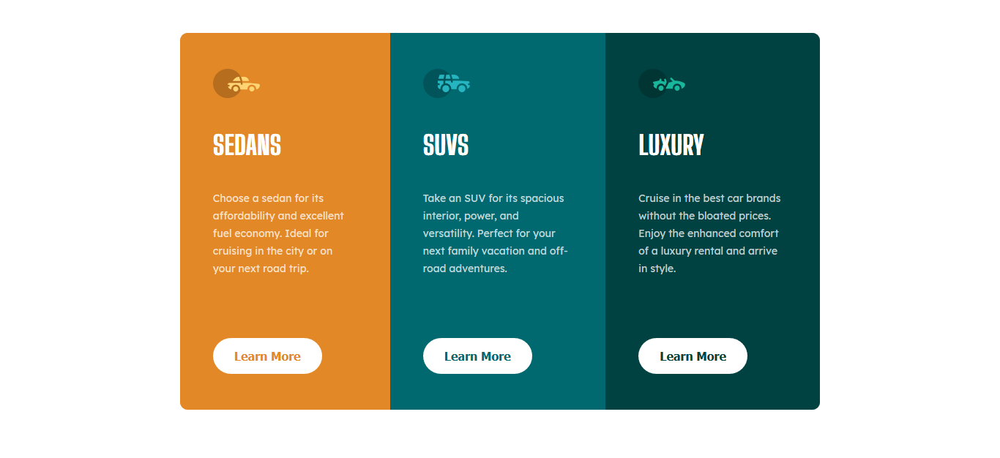
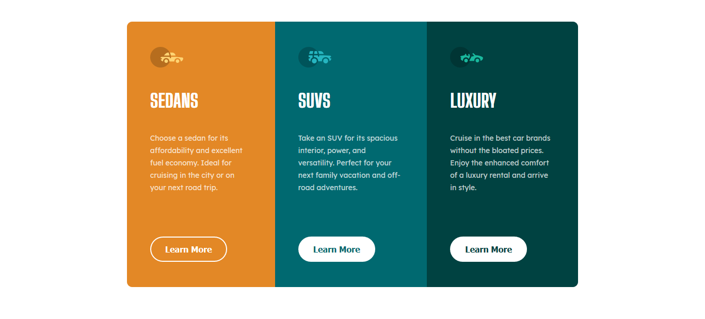
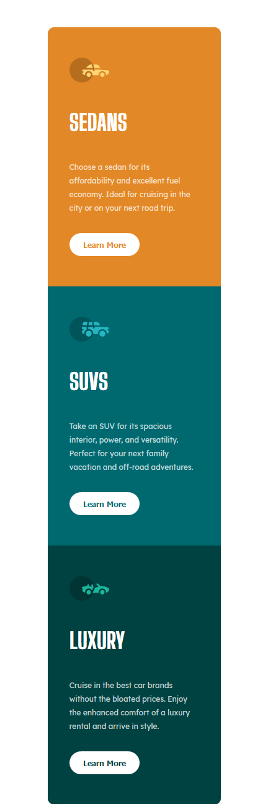

# 3-column preview card component solution

This is a solution to the [3-column preview card component challenge on Frontend Mentor](https://www.frontendmentor.io/challenges/3column-preview-card-component-pH92eAR2-). Frontend Mentor challenges help you improve your coding skills by building realistic projects. 

## Table of contents

- [Overview](#overview)
  - [The challenge](#the-challenge)
  - [Screenshot](#screenshot)
  - [Links](#links)
- [My process](#my-process)
  - [Built with](#built-with)
- [Author](#author)

## Overview

### The challenge

- View the optimal layout depending on their device's screen size
- See hover states for interactive elements

### Screenshot

### Links

- Solution URL: [Solution - Frontendmentor](https://www.frontendmentor.io/solutions/3-column-card-preview-component-with-html-and-css-flexbox-KAhHNuo8g)
- Live Site URL: [Live site](https://gustcodetheone.github.io/3columnPreviewCardComponent/)

## My process

### Built with

- Semantic HTML5 markup
- Flexbox
- Mobile-first workflow

## Author

- Website - [Gustavo Nieves](https://github.com/gustCodeTheOne/)
- Frontend Mentor - [@gustCodeTheOne](https://www.frontendmentor.io/profile/gustCodeTheOne)
